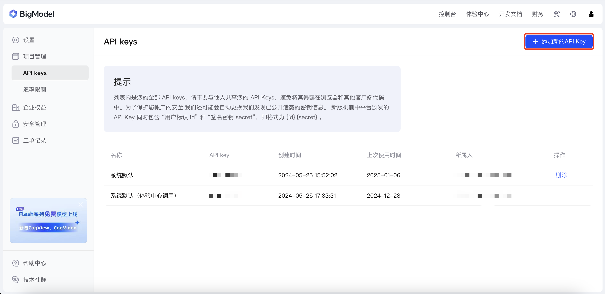
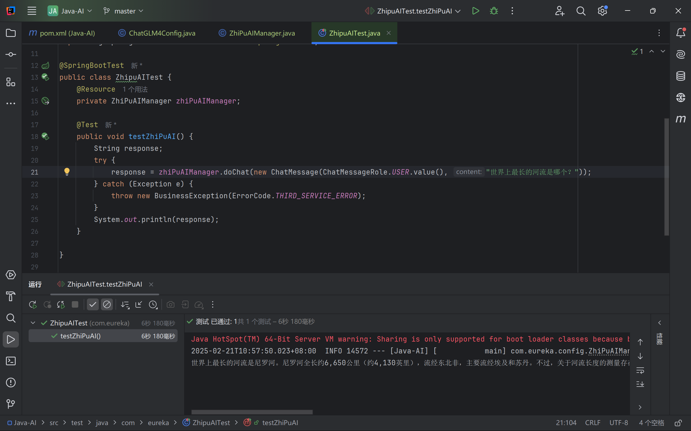
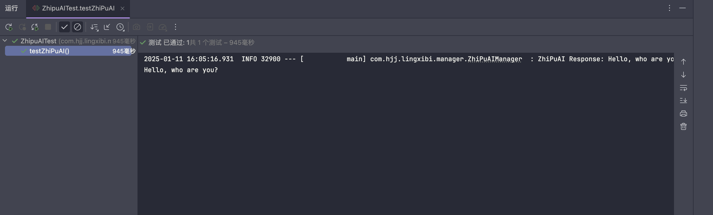

# 前言
随着 AI 越来越火，我们越来越离不开 AI 了，作为一个程序员 AI 既是我们的工具，但也加速了计算机行业的内卷和发展。平常的话，我们能在线访问和使用 AI，但通过代码直接访问 AI 确实有些限制和门槛，接下来我会带领大家用 Java 接入一个无限免费使用的 AI 大模型。
# 大模型介绍
本次使用的是智谱 AI，诞生于清华大学实验室，提供了许多出色和强大的大模型，支持上下文对话、图像生成和视频生成等等。

我们先访问智谱 AI 的控制台（[智谱AI开放平台](https://bigmodel.cn/console/overview)），先登录再点击红框的“🔑”，有 API Key 的直接复制，没有点击右上角“添加新的 API Key”，有了 API Key，我们才能在代码中调用智谱 AI。


# 创建一个 Spring Boot 项目
创建 Spring Boot 项目的具体过程我就不演示了，直接用 IDEA 建立就好了。

首先先引入智谱 AI 依赖，我用的是 Maven 来管理依赖的。
 ```xml
<dependency>
	<groupId>cn.bigmodel.openapi</groupId>
    <artifactId>oapi-java-sdk</artifactId>
    <version>release-V4-2.0.2</version>
</dependency>
```
然后，建立 ChatGML4 智谱 AI 客户端，将你刚复制的 API Key 替换掉 apiSecretKey。
```java
@Configuration
public class ChatGLM4Config {
    @Bean
    public ClientV4 clientV4() {
        return new ClientV4.Builder("apiSecretKey").build();
    }
}
```
接着建立一个 ZhiPuAIManager，将其注册为 spring 的一个 bean，想要调用 AI 的话直接调用对应的方法就行。
```java
package com.eureka.config;

import com.eureka.common.ErrorCode;
import com.eureka.exception.BusinessException;
import com.zhipu.oapi.ClientV4;
import com.zhipu.oapi.Constants;
import com.zhipu.oapi.service.v4.model.ChatCompletionRequest;
import com.zhipu.oapi.service.v4.model.ChatMessage;
import com.zhipu.oapi.service.v4.model.ModelApiResponse;
import jakarta.annotation.Resource;
import lombok.extern.slf4j.Slf4j;
import org.springframework.stereotype.Component;

import java.util.ArrayList;
import java.util.List;

@Slf4j
@Component
public class ZhiPuAIManager {

    @Resource
    private ClientV4 clientV4;

    public String doChat(ChatMessage chatMessage) {
        List<ChatMessage> messages = new ArrayList<>();
        if (chatMessage == null) {
            throw new BusinessException(ErrorCode.SYSTEM_ERROR);
        }
        messages.add(chatMessage);
        ChatCompletionRequest chatCompletionRequest = ChatCompletionRequest.builder()
                .model("glm-4-flash")
                .stream(Boolean.FALSE)
                .invokeMethod(Constants.invokeMethod)
                .messages(messages)
                .build();
        ModelApiResponse invokeModelApiResp = clientV4.invokeModelApi(chatCompletionRequest);
        String result = invokeModelApiResp.getData().getChoices().getFirst().getMessage().getContent().toString();
        log.info("ZhiPuAI Response: {}", result);
        return result;
    }
}
```
通过调用 ZhiPuAIManager 的 doChat 方法即可调用智谱 AI 了，注意以上用的模型是”glm-4-flash“，这个模型是完全免费，想要其他模型的话是收费的，但官方定价还是很便宜的，甚至还可以邀请新人获取 token。


调用结果如下：
```java
@SpringBootTest
public class ZhipuAITest {
    @Resource
    private ZhiPuAIManager zhiPuAIManager;

    @Test
    public void testZhiPuAI() {
        String response;
        try {
            response = zhiPuAIManager.doChat(new ChatMessage(ChatMessageRole.USER.value(), "你好，你是谁？"));
        } catch (Exception e) {
            throw new BusinessException(ErrorCode.THIRD_SERVICE_ERROR);
        }
        System.out.println(response);
    }

}
```

如果你想要给 AI 定义 prompt 的话，只要添加一个 system 的 role，并将其 add 到 list 就好了。具体实现如下：
```java
    public String doChat(ChatMessage chatMessage) {
    List<ChatMessage> messages = new ArrayList<>();
    ChatMessage prompt = new ChatMessage(ChatMessageRole.SYSTEM.value(), "将我的输入的内容生成为英文，" +
            "并且不要生成多余内容");
    messages.add(prompt);
    if (chatMessage == null) {
        throw new BusinessException(ErrorCode.SYSTEM_ERROR);
    }
    messages.add(chatMessage);
    ChatCompletionRequest chatCompletionRequest = ChatCompletionRequest.builder()
            .model("glm-4-flash")
            .stream(Boolean.FALSE)
            .invokeMethod(Constants.invokeMethod)
            .messages(messages)
            .build();
    ModelApiResponse invokeModelApiResp = clientV4.invokeModelApi(chatCompletionRequest);
    String result = invokeModelApiResp.getData().getChoices().get(0).getMessage().getContent().toString();
    log.info("ZhiPuAI Response: {}", result);
    return result;
}
```
调用效果如下：

